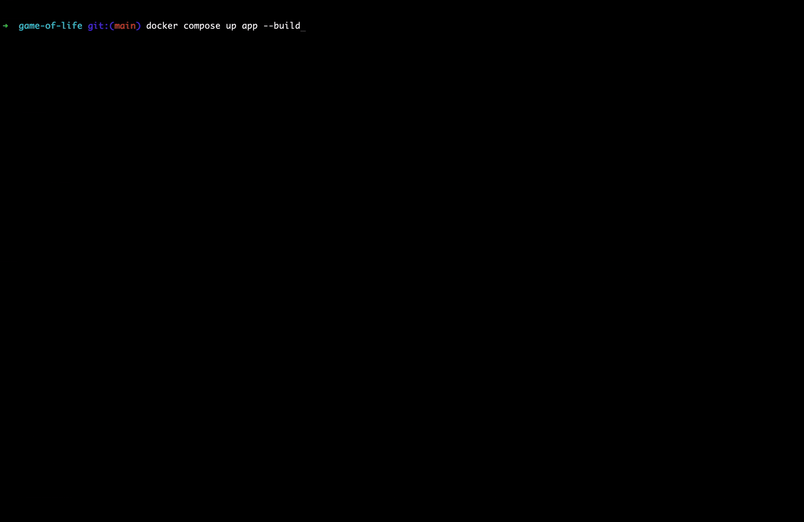

# Game of Life

## Overview

A standalone microservice implementing Conway's Game of Life, built with PHP and designed to run in a Dockerized environment using the `php-cli` base image.

---

## Features
 
- **Immutable Grid** — Every change creates a new Grid instance; no shared mutable state
- **Stateless Execution** — each run simulates the game and exits
- **Hashmap-Based Grid** — constant-time cell access
- **Clean Architecture** — follows SOLID principles, especially Dependency Inversion
- **Extensible** — swap out the game logic or presentation layer easily
- **Dockerized** — runs in a lightweight container using `php-cli`
- **Testable** — includes a PHPUnit-based test suite

---

## Installation

### 1. Clone the repository

```bash
git clone git@github.com:majidakbari/game-of-life.git
cd game-of-life
```

### 2. Set up environment variables

Copy the example environment file and adjust values as needed. You can change the grid size here.

```bash
cp .env.example .env
```

---

## Running the App

This PHP CLI application runs once per execution and exits. The Docker container will restart automatically if the process exits with a non-zero code.

### Run the application

```bash
docker compose up app
```

### Run the tests

```bash
# Unit tests
docker compose up test
```

---

## Code Style & Quality

Run PHP CodeSniffer to fix code style issues:

```bash
./vendor/bin/phpcs
```

## Suggestions for improvement

- Add integration and feature tests for broader coverage
- Apply static analysis tools like PHPStan
- Integrate SonarQube for continuous code quality
- Use a process manager (e.g., Supervisor) to keep the container alive if needed
- Optimize Dockerfile using multi-stage builds and lightweight base images like Alpine
- Add a logging layer to observe the application behaviour and capture possible issues.

---

## Architecture Notes

- The grid is implemented using a **hashmap**, allowing constant-time complexity for cell lookup.
- The codebase respects **Dependency Inversion**, enabling easy swapping of game logic or presentation layers.

---

## Contributing

You're welcome to contribute! You can extend or replace:

- The `Presentation` layer — e.g., switch from terminal to web
- The `Game` engine — for custom rules or behaviors

Make sure to follow existing patterns and keep code clean.

---

## Demo



---

## License

This project is open-source and available under the [MIT License](LICENSE).
